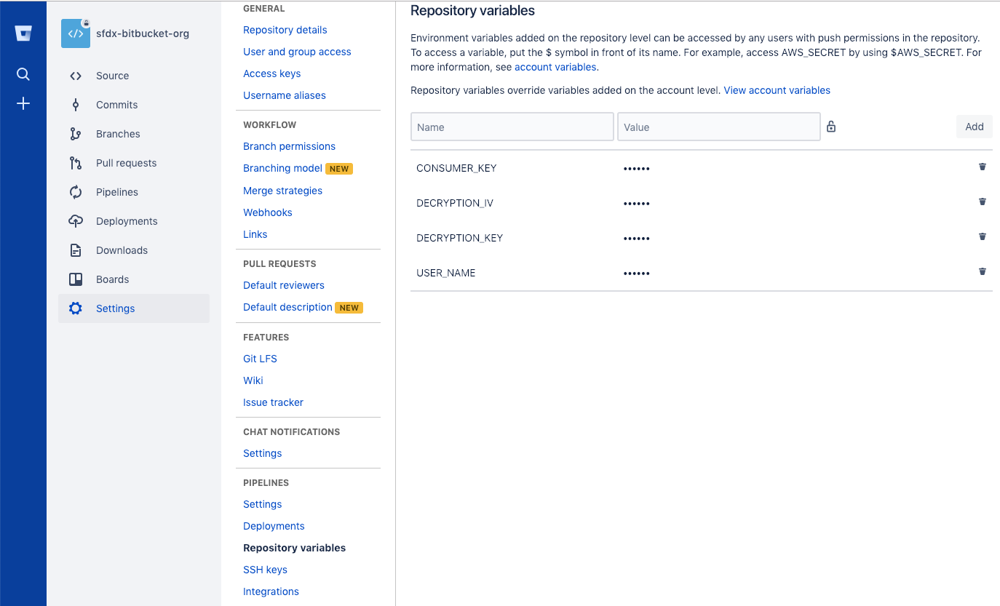

# sfdx-bitbucket-org 

For a fully guided walkthrough of setting up and configuring continuous integration using scratch orgs and Salesforce CLI, see the [Continuous Integration Using Salesforce DX](https://trailhead.salesforce.com/modules/sfdx_travis_ci) Trailhead module.

This repository shows how to successfully set up deploying to non-scratch orgs (sandbox or production) with Bitbucket Pipelines. We make a few assumptions in this README. Continue only if you have completed these critical configuration prerequisites.

- You know how to get your Bitbucket repository set up with pipelines. (Need help? See the Bitbucket [Getting Started guide](https://confluence.atlassian.com/bitbucket/get-started-with-bitbucket-pipelines-792298921.html).)
- You have properly set up JWT-based authorization flow (headless). We recommend using [these steps for generating your self-signed SSL certificate](https://devcenter.heroku.com/articles/ssl-certificate-self). 

## Getting Started
1) [Fork](http://help.github.com/fork-a-repo/) this repo to your GitHub account using the fork link at the top of the page.

2) Clone your forked repo locally: `git clone https://github.com/<git_username>/sfdx-bitbucket-org`

3) Make sure that you have Salesforce CLI installed. Run `sfdx force --help` and confirm you see the command output. If you don't have it installed, download and install it from [here](https://developer.salesforce.com/tools/sfdxcli).

4) Set up a JWT-based auth flow for the target orgs that you want to deploy to. This step creates a `server.key` file that is used in subsequent steps.
(https://developer.salesforce.com/docs/atlas.en-us.sfdx_dev.meta/sfdx_dev/sfdx_dev_auth_jwt_flow.htm)

5) Confirm that you can perform a JWT-based auth: `sfdx auth:jwt:grant --clientid <your_consumer_key> --jwtkeyfile server.key --username <your_username> --setdefaultdevhubusername`

   **Note:** For more info on setting up JWT-based auth, see [Authorize an Org Using the JWT-Based Flow](https://developer.salesforce.com/docs/atlas.en-us.sfdx_dev.meta/sfdx_dev/sfdx_dev_auth_jwt_flow.htm) in the [Salesforce DX Developer Guide](https://developer.salesforce.com/docs/atlas.en-us.sfdx_dev.meta/sfdx_dev).

6) Encrypt and store the generated `server.key`.  IMPORTANT!  Don't store the `server.key` file within the project.

- First, generate a key and initializtion vector (iv) to encrypt your `server.key` file locally. The key and iv are used by Bitbucket Pipeplines to decrypt your server key in the build environment.

```bash
$ openssl enc -aes-256-cbc -k <passphrase here> -P -md sha1 -nosalt
  key=E5E9FA1BA31ECD1AE84F75CAAA474F3A663F05F412028F81DA65D26EE56424B2
  iv =E93DA465B309C53FEC5FF93C9637DA58
```

> Make note of the `key` and `iv` values output to the screen. You'll use the values following `key=` and `iv =` to encrypt your `server.key`.

- Encrypt the `server.key` using the newly generated `key` and `iv` values. Use the `key` and `iv` values only once, and don't use them to encrypt more than the `server.key`. While you can re-use this pair to encrypt other things, it's considered a security violation to do so. Every time you run the command above, a new `key` and `iv` value are generated.  Don't regenerate the same pair. If you lose these values, generate new ones and encrypt again.

```bash
openssl enc -nosalt -aes-256-cbc -in your_key_location/server.key -out assets/server.key.enc -base64 -K <key from above> -iv <iv from above>
```
 This step replaces the existing `server.key.enc` with your encrypted version.
 
- Store the `key`, and `iv` values somewhere safe. You'll use these in values in a subsequent step in the Bitbucket Pipeplines UI. These values are considered *secret* so please treat them as such.

7) From your JWT-based connected app on Salesforce, retrieve the generated `Consumer Key` and store in a Bitbucket Pipeplines environment variable named `CONSUMER_KEY` using the Bitbucket Pipelines UI.

8) Store the user name that you use to access your target org in a Bitbucket Pipeplines environment variable named `USER_NAME` using the Bitbucket Pipeplines UI. Note that this username is the username that you use to login in to your target org.

9) Store the `key` and `iv` values used above in Bitbucket Pipeplines environment variables named `DECRYPTION_KEY` and `DECRYPTION_IV`, respectively. When finished setting environment variables, the environment variables setup screen should look like the one below.

10) Store the login URL of the instance the org lives on in a Bitbucket Pipeplines environment variable named `ENDPOINT` using the Bitbucket Pipeplines UI.



11) Commit the updated `server.key.enc` file.

Now you're ready to go! When you commit and push a change, your change kicks off a Bitbucket Pipelines build.

Enjoy!

## Environment Variables

| Env Var                       | Description                                                                                                     |
| ----------------------------- | --------------------------------------------------------------------------------------------------------------- |
| CONSUMER_KEY                  | From your JWT-based connected app on Salesforce, retrieve the generated `Consumer Key` from your Dev Hub org.   |
| USER_NAME                     | This username is the username that you use to access your Dev Hub.                                              |
| ENDPOINT                      | the login URL of the instance the org lives on.                                                                 |
| DECRYPTION_KEY                | `server.key` encryption key.                                                                                    |
| DECRYPTION_IV                 | `server.key` encryption initialization Vector.                                                                  |
| DX_CLI_URL_CUSTOM             | By default, the script installs the current version of Salesforce CLI. To install the release candidate, set the `DX_CLI_URL_CUSTOM` local variable to the appropriate URL.|


## Contributing to the Repository ###

If you find any issues or opportunities for improving this repository, fix them! Feel free to contribute to this project by [forking](http://help.github.com/fork-a-repo/) this repository and making changes to the content. Once you've made your changes, share them back with the community by sending a pull request. See [How to send pull requests](http://help.github.com/send-pull-requests/) for more information about contributing to GitHub projects.

## Reporting Issues ###

If you find any issues with this demo that you can't fix, feel free to report them in the [issues](https://github.com/forcedotcom/sfdx-bitbucket-org/issues) section of this repository.
